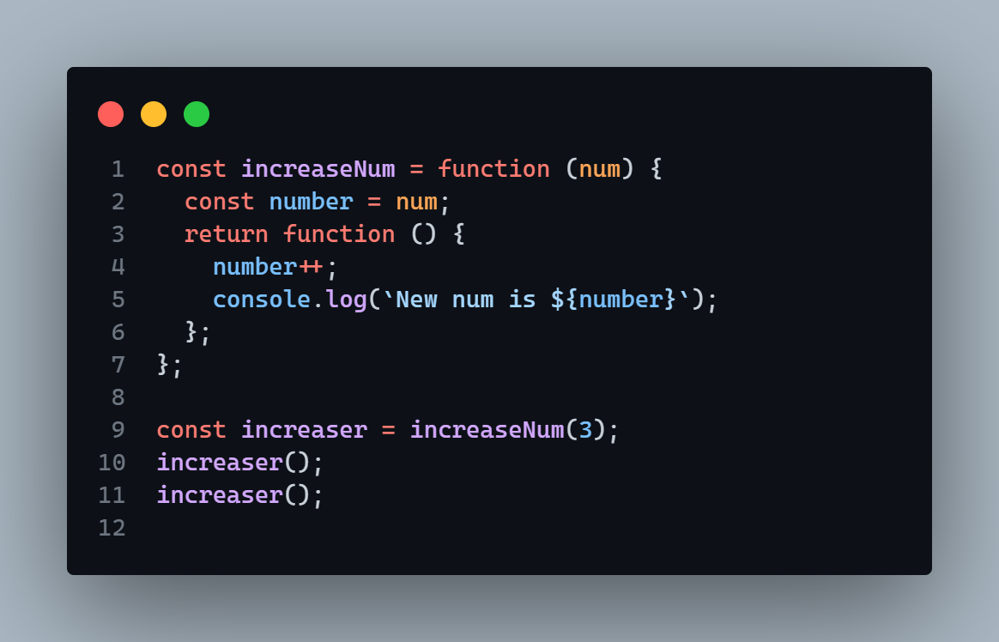

# JavaScript Special

## DOM Manipulation

### IntersectionObserver API

Used in doing certain DOM manipulations upon intersection of defined DOM elements. Example is as below:


- `root: null` specifiies intersection with element with the current view port
- `threshhold` can take one value or an array. They all specify at what percentage after intersection with element should the observer fire an entry. 0.2 will result in an entry after 20% of the element intersects with the root in this case.
- `rootMargin` offers the margin to the threshold. If `-value`px, it will fire an entryat `value`px before the `threshold` is met.
- The callback takes parameters as entries and the observer set, in this case the `elementObserver` observer.

### Smooth Scroll

```js
sectionToScrollTo.scrollIntoView({ behaviour: 'smooth' });
```

### Array Methods

#### Array.from

Can be used to create arrays from array like structures. First parameter is an `iterable` and second a `callback function`.
This example creates an array from 1 to 8

```js
Array.from({ length: 8 }, (_, i) => i + 1);
```

#### Flat and Flatmap

Flat `arr.flat()` reduces a nested array to a single un-nested one. It takes 1 parameter defining the nesting depth to undo. Default is 1.
`Flatmap` is similar but instead of depth parameter, it takes a callback function to iterate the array. Depth is therefore always 1 but results of the callback is from an array that was first mapped then flattened (`map` first then `flat`).

### Optional Chaining

Helps prevent errors in case a property does not exist, returning undefined instead. Syntax is using `?.` before upcoming properties.

```js
restaurants?.openingHours?.mon?.time ?? defaultValue = whatever;

// Or

const list = [];
console.log(list[0]?.name ?? 'List is empty');

```

### Nullish Coalescing Operator (`??`)

Returns `false` only if the conndition is `undefined` or `null`. Other values like empty strings, 0 etc. are considered true.

### Map Iterable

Map is similar to objects but the keys can be anything unlike in objects where the keys are strings.

```js
// ! Properties are set, get, size, clear, delete.

const map = new Map();

map.set(1, 'foo');
// * Set property returns a map and other map properties can be stringed along as...

map.set(2, 'two').set(true, 'true value').set('categories', ['list1', 'list2']);

console.log(map.get('categories'));
console.log(map.size);
console.log(map.delete(false));
map.clear();
```

To use arrays as keys, the array must first be initialized so it points to the same address that can be used in the `get` method.

```js
const arr = [1, 2];
map.set(arr, 'Array as key');
map.get(arr);
```

Instead of using `set`, a simpler syntax is using array of arrays like the result of using `Object.entries()` to set map items. Map iterables also have the methods `.entries()`, `.keys()` and `.values()`.

````js
const betterMap = new Map([
  [1, 'one'], // item 1
  [2, 'two'], // item 2
]);

// Or use a ```Object.entries()``` method to create a new map.

const otherMap = new Map(Object.entries(someObject));
````

### Immediately Invoked Function Expressions (IIFE)

These are anonymous functions called only once during their creation and as they don\`t have a name, they cannot be recalled. They are enclosed in brackets to look like `expressions` and then invoked directly.

```js
(function () {
  /* Code goes here*/
})();

// Or for `arrow functions`

(() => {})();
```

### Closure

Closure gives a function access to parent function variables even after the parent function is done with execution and has returned.
Is a way of variable protection from being accessed outside the defining function.
Use `console.dir(returnedFunc)` to see the variable environment in the closure involved.

#### Simple Example



#### Application Example

```js
// Protection of variables mainly

function newAccount(name, initialBalance) {
  let balance = initialBalance;

  function showBalance() {
    console.log(`Hello ${name}, balance is ${balance}`);
  }

  function deposit(amount) {
    if (amount) {
      balance += amount;
    }
    showBalance();
  }

  function withdraw(amount) {
    if (amount > balance) {
      console.log('Insufficient funds...');
      return;
    }
    if (amount) {
      balance -= amount;
    }
    showBalance();
  }

  return {
    showBalance: showBalance,
    deposit: deposit,
    withdraw: withdraw,
  };
}

const testAccount = newAccount('Han', 200);
testAccount.showBalance();
testAccount.deposit(300);
testAccount.showBalance();
testAccount.withdraw(400);

// Cant control the balance
testAccount.balance = 9000;
```

## Asynchronous JS

- Promises
  - Resolve `.then`
  - Reject `.catch`

```js
btn.addEventListener('click', () => {
  loadImage(url)
    .then((data) => {
      cont.appendChild(data);
    })
    .catch((err) => {
      console.log(err);
    });
});

function loadImage(url) {
  return new Promise((resolve, reject) => {
    let img = new Image();
    img.addEventListener('load', () => {
      resolve(img);
    });
    img.addEventListener('error', () => {
      reject(new Error(`Something wrong with the url ${url}`));
    });
    img.src = url;
  });
}
```

## AJAX

### XMLHttpRequest

```js
const xhr = new XMLHttpRequest();

xhr.open('GET', './api/sample.txt');

xhr.onreadystatechange = () => {
  if (xhr.readyState === 4 && xhr.status === 200) {
    console.log('done successfully');
  } else {
    console.log({ status: xhr.status, text: xhr.statusText });
  }
};

xhr.send();
```

### Fetch

Similar to `xhr` but has a much simpler, cleaner syntax. `Fetch` returns a response in form of a string which can be converted to a json using `.json()` - A method that returns a `Promise` that can be handled as any other object.

```js
fetch(url)
  .then((Response) => Response.json())
  .then((data) => console.log(data))
  .catch((error) => console.log(error));
```

Same thing can be accomplished using `async await` functions with fetch... Enclose em in `try catch` blocks if you may.

```js
document.addEventListener('DOMContentLoaded', async () => {
  try {
    const response = await fetch(url);
    const data = await response.json();
    console.log(data);
  } catch (error) {
    console.log(error);
  }
});
```

### Extras

Random number between 2 specified limits

```js
Math.floor(Math.random() * (max - min + 1) + min);
```

Some common JS concepts, OOP and Classes

- Apply()
- Bind()
- String template literal tagging function
- ES 6
- Object convertion to array using:
  - Object.keys()
  - Object.values()
  - Object.entries()
- Set
